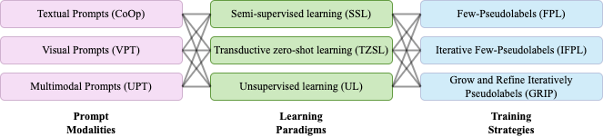

# Enhancing CLIP with CLIP: Pseudolabeling for Limited-Labeled Prompt Tuning

This repository contains the code to reproduce the experiments from the paper ["Enhancing CLIP with CLIP: Pseudolabeling for Limiter-Labeled Prompt Tuning"](ADD LINK). The paper explores the effect of leveraging pseudolabels to adapt vision-language models such as CLIP to downstream tasks in a unified way across prompt modalities, learning paradigms, and training strategies.

<div align="center">
    
</div>


## Table of Contents

- [Setup](#setup)
- [Data](#data)
- [Experiments](#experiments)
- [Results](#results)
- [Citation](#citation)

## Setup

To set up the project environment, follow these steps:

1. Ensure that you have Python version 3.7.4 installed. You can check the Python version by running the following command:

    ```bash
    python --version
    ```

2. Clone the repository by running the following command:

    ```bash
    git clone https://github.com/BatsResearch/menghini-enhanceCLIPwithCLIP-code.git
    ```

3. Navigate to the root folder and execute the `setup.sh` script to install the required dependencies, including `pytorch`. Note that we assume the installation of a CUDA-compatible version of `pytorch` since GPUs are recommended for running the experiments. If you don't have access to GPUs, you can modify the script to remove the CUDA requirement. 

    ```bash
    cd menghini-enhanceCLIPwithCLIP-code/
    bash setup.sh
    ```

[Back to Table of Contents](#table-of-contents)

## Data

The experiments are conducted on the following six datasets: **F**lowers102, **R**ECSIS45, **F**GVC-Aircraft, **M**NIST, **E**uroSAT, and **D**TD (FRAMED). We use the train and test splits provided in the paper [ELEVATER: A Benchmark and Toolkit for Evaluating Language-Augmented Visual Models](https://openreview.net/pdf?id=hGl8rsmNXzs).

To access the FRAMED dataset, you can download it [here](https://drive.google.com/file/d/1_ns7regg8dfAAGmYcmCXa5ryuJeOoug-/view?usp=share_link). After downloading, unzip the folder to obtain the required data.

If you encounter any issues with the download or prefer an alternative method, you can follow these steps:

1. Download the data by following the instructions provided [here](https://github.com/Computer-Vision-in-the-Wild/DataDownload).
2. Rename the folders as follows:
   - `dtd/` to `DTD/`
   - `eurosat_clip/` to `EuroSAT/`
   - `fgvc-aircraft-2013b-variants102/` to `FGVCAircraft/`
   - `oxford-flower-102/` to `Flowers102/`
   - `mnist/` to `MNIST/`
   - `resisc45_clip/` to `RESICS45/`
3. Ensure that each folder contains the following files:
   - `DTD/` should contain the [`class_names.txt`](https://github.com/BatsResearch/co-training-clip/blob/reproducibility/data/class_files/DTD/class_names.txt) file
   - `EuroSAT/` should contain the [`class_names.txt`](https://github.com/BatsResearch/co-training-clip/blob/reproducibility/data/class_files/EuroSAT/class_names.txt) file
   - `FGVCAircraft/` should contain the [`labels.txt`](https://github.com/BatsResearch/co-training-clip/blob/reproducibility/data/class_files/FGVCAircraft/labels.txt) file
   - `Flowers102/` should contain the [`class_names.txt`](https://github.com/BatsResearch/co-training-clip/blob/reproducibility/data/class_files/Flowers102/class_names.txt) file
   - `MNIST/` should contain the [`labels.txt`](https://github.com/BatsResearch/co-training-clip/blob/reproducibility/data/class_files/MNIST/labels.txt) file

[Back to Table of Contents](#table-of-contents)

## Experiments

Before running the experiments, create the following folders to save prompts, pseudolabels, and results.

```bash
mkdir pseudolabels
mkdir logs
mkdir trained_prompts
mkdir evaluation
```

We organized the code such that for each learning paradigm we can run any combination of prompt modality and training strategy.

### Baselines

1. CLIP [1]
    ```
    bash scripts/run_clip.sh
    ```
2. Standard prompt tuning without pseudolabels: CoOp [2], VPT [3], UPT [4].
    - For SSL:
        ```
        bash scripts/run_prompts_ssl.sh
        ```
    - For TRZSL:
        ```
        bash scripts/run_prompts_trzsl.sh
        ```

### Training strategies employing pseudolabels

To execute the training strategies employing pseudolabels across prompt modalities run the following
    
- For SSL:  
    ```
    bash scripts/run_pseudolabels_ssl.sh
    ```

- For UL:  
    ```
    bash scripts/run_pseudolabels_ul.sh
    ```

- For TRZSL:
    ```
    bash scripts/run_pseudolabels_trzsl.sh
    ```

Logs of the runs are save in `logs/`.
The folder `pseudolabels/` gathers the pseudolabeled used for each prompt modality, leanring paradigms, and training strategies. For iterative methods, we store them at each iteration.
In `trained_prompts/`, we save the prompts used to make predictions. For iterative methods, we save the prompts at each iteration. 
While in `evaluation/` there will be the predictions of each method. 

[Back to Table of Contents](#table-of-contents)


[1] [Learning Transferable Visual Models From Natural Language Supervision, Radford et al. 2021](https://arxiv.org/pdf/2103.00020.pdf)

[2] [Learning to prompt for vision-language models, Zhou et al. 2021](https://arxiv.org/pdf/2109.01134.pdf)

[3] [Visual prompt tuning, Jia et al. 2022](https://arxiv.org/pdf/2203.12119.pdf)

[4] [Unified vision and language prompt learning, Zang et al., 2022](https://arxiv.org/pdf/2210.07225.pdf)

## Results

To be filled with the results obtained from the experiments.


**Textual prompts**
| |   |   |   |   |   |   |   |   |   |
|---------------------|:---:|:---:|:---:|:---:|:---:|:---:|:---:|:---:|:---:|
|                     |  | **Flowers102** | |  | **RESICS45** |  |  | **FGVCAircraft** |  |
| **Method**          | **SSL** | **UL** | **TRZSL** | **SSL** | **UL** | **TRZSL** | **SSL** | **UL** | **TRZSL** |
| CLIP [1]            | 63.7 | 63.7 | 63.4 | 54.5 | 54.5 | 54.5 | **17.6** | **17.6** | 17.9 |
| CoOp [2]               | 76.8 | - | 63.2 | 58.5 | - | 63.4 | 14.9 | - | 21.7 |
| GRIP                | **83.6** | **69.8** | **86.3** | **74.1** | **70.6** | **81.1** | 17.0 | 15.2 | **26.1** |
|                     |  | **MNIST** |  |  | **EuroSAT** |  |  | **DTD** |  |
| CLIP                | 25.1 | 25.1 | 20.8 | 32.9 | 32.9 | 30.5 | 43.2 | 43.2 | 43.4 |
| CoOp  [2]              | 56.4 | - | 21.2 | 59.5 | - | 49.7 | 37.1 | - | 46.3 |
| GRIP                | **71.8** | **67.9** | **74.1** | **58.7** | **57.2** | **92.3** | **56.1** | **46.1** | **65.3** |

**Visual prompts** 
| |   |   |   |   |   |   |   |   |   |
|---------------------|:---:|:---:|:---:|:---:|:---:|:---:|:---:|:---:|:---:|
|                     |  | **Flowers102** |  |  | **RESICS45** |  |  | **FGVCAircraft** |  |
| **Method**          | **SSL** | **UL** | **TRZSL** | **SSL** | **UL** | **TRZSL** | **SSL** | **UL** | **TRZSL** |
| CLIP [1]             | 63.7 | **63.7** | 63.4 | 54.5 | 54.5 | 54.5 | 17.6 | **17.6** | 17.9 |
| VPT  [3]               | 63.7 | - | 64.7 | 60.8 | - | 67.1 | 17.8 | - | 26.7 |
| GRIP                | **67.9** | **63.1** | **77.2** | **71.2** | **68.4** | **82.2** | **19.4** | **17.5** | **26.4** | 
|                     |  | **MNIST** |  |  | **EuroSAT** |  |  | **DTD** |  |
| CLIP [1]             | 25.1 | 25.1 | 20.8 | 32.9 | 32.9 | 30.5 | 43.2 | 43.2 | 43.4 |
| VPT  [3]               | 42.5 | - | 25.5 | 47.1 | - | 62.2 | 36.4 | - | 44.2 | 
| GRIP                | **69.7** | **68.0** | **69.5** | **63.5** | **63.7** | **97.0** | **54.6** | **50.5** | **62.8** |

**Multimodal prompts**
| |   |   |   |   |   |   |   |   |   |
|---------------------|:---:|:---:|:---:|:---:|:---:|:---:|:---:|:---:|:---:|
|                     |  | **Flowers102** |  |  | **RESICS45** |  |  | **FGVCAircraft** |  |
| **Method**          | **SSL** | **UL** | **TRZSL** | **SSL** | **UL** | **TRZSL** | **SSL** | **UL** | **TRZSL** |
| CLIP [1]                | 63.7 | **63.7** | 63.4 | 54.5 | 54.5 | 54.5 | **17.6** | **17.6** | **17.9** |
| UPT  [4]               | 68.0 | - | 61.1 | 62.8 | - | 58.8 | 11.1 | - | 15.9 |
| GRIP                | **74.6** | **64.8** | **82.0** | **73.7** | **69.4** | **82.2** | **17.4** | 14.7 | **17.9** | 
|                     |  | **MNIST** |  |  | **EuroSAT** |  |  | **DTD** |  |
| CLIP                | 25.1 | 25.1 | 20.8 | 32.9 | 32.9 | 30.5 | 43.2 | 43.2 | 43.4 |
| UPT  [4]               | **64.4** | - | 63.6 | 68.9 | - | 60.4 | 43.7 | - | 36.9 | 
| GRIP                | **65.9** | **68.2** | **73.8** | **60.4** | **61.5** | **95.5** | **54.1** | **47.4** | **64.4** |


[Back to Table of Contents](#table-of-contents)

## Citation 

If you find this work helpful, please consider citing the following paper:

```
@article{menghini:enhanceCLIPwithCLIP2023,
  Author = {Menghini, C. and Delworth, A. and Bach, S. H.},
  Title = {Enhancing CLIP with CLIP: Pseudolabeling for Limited-Labeled Prompt Tuning},
  Journal = {enter arxiv code}
  Year = {2023}
  }
```

[Back to Table of Contents](#table-of-contents)